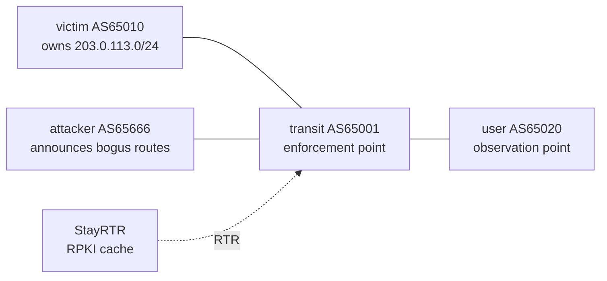

# BGP Hijack & Detection Lab

A fully reproducible, container-based lab for **attacking, defending, and detecting BGP prefix hijacks** on a single laptop. Every experiment runs in a closed lab I fully control, is measured with a clean before/after (A/B) method, and can be replayed with one command.

The lab tells one honest story: a simple hijack is stopped by standard defenses — but a smarter **forged-origin** hijack slips past RPKI/ROV, the strongest cryptographic defense available today. A lightweight anomaly detector then catches exactly what RPKI cannot.

 

> **Scope, stated honestly.** BGP hijack detection and mitigation is a mature research field. The value here is **reproducible engineering + measured experiments in a controlled testbed**, not academic novelty. No public networks are ever touched.

## Why this lab

BGP has no built-in way to verify *"do you actually own this address block, and is this path real?"*. Routers trust their neighbors' announcements. This lab reproduces that weakness in miniature, runs concrete attacks, applies real defenses, finds **where those defenses break**, and detects the break.

## Topology



- **victim** originates the legitimate prefix `203.0.113.0/24`.
- **attacker** owns a legitimate `192.0.2.0/24` and, on demand, announces bogus routes: a sub-prefix `203.0.113.0/25`, or the victim's exact `/24` with a forged AS_PATH.
- **transit** is the provider both connect through — the point where traffic is redirected or where a defense stops the attack.
- **user** is a third party whose traffic we track.
- **StayRTR** serves a self-made ROA to transit over the RTR protocol for RPKI validation.

## Results at a glance (RQ1 matrix)

| Attack | No defense | Prefix-list (in) | RPKI / ROV | Intent detector |
|---|---|---|---|---|
| **Sub-prefix hijack** (`/25`) | HIT (E2) | BLOCKED (E3) | BLOCKED (E4) | R1 + R2 (pre-policy) |
| **Forged-origin hijack** (`/24`) | HIT (E5) | HIT | **HIT — bypass (E5)** | **CAUGHT — R3 (E6)** |

Full matrix and evidence: [`RESULTS-matrix.md`](RESULTS-matrix.md) · chronological log: [`LABNOTES.md`](LABNOTES.md).

## Key findings

- **`0% packet loss` can hide an attack.** During a hijack the ping still succeeds — because the *attacker* answers. Availability stays intact while integrity is broken; silent interception is worse than an outage.
- **RPKI labels, policy enforces.** RPKI marks a sub-prefix hijack `Invalid`, but that alone does not stop it — the route stays best and installed. A route-map rejecting `Invalid` routes is what turns the label into protection.
- **RPKI validates the origin, not the path.** A forged-origin hijack announces the victim's exact `/24` with AS_PATH `65666 65010`. RPKI reads the origin (`65010`), matches the ROA, and marks it **Valid** — so ROV lets it through. This is the gap that BGPsec (path signing) and ASPA (AS-relationship validation) exist to close.
- **Intent-based detection catches what prevention cannot.** The detector flags the forged route because the implied link `65666 -> 65010` is not a real adjacency — even while RPKI calls it `valid` and even before the route wins best-path (early warning).
- **A post-policy detector has a blind spot.** Reading the Loc-RIB, the detector cannot see an attack that a defense already blocked at ingress (e.g. the `/25` under ROV). Logging attempted-but-blocked attacks needs pre-policy visibility (Adj-RIB-In via soft-reconfiguration or BMP).

## Requirements

- Linux with Docker
- [containerlab](https://containerlab.dev)
- Python 3 (standard library only — no external packages)
- ~250 MiB RAM for the 4-node lab plus RPKI cache (measured; scales to ~35 nodes on 8 GB)

Exact pinned versions are in [`VERSIONS.md`](VERSIONS.md) (the FRR image is pinned by digest for reproducibility).

## Quick start

```bash
# 1. validate all router configs (with a built-in negative-control self-test)
./scripts/lint.sh

# 2. deploy the 4-node topology
containerlab deploy -t bgp-lab.clab.yml

# 3. start the RPKI cache (StayRTR) on the lab network, serving our self-made ROA
docker run -d --name rtr --network clab \
  -v "$PWD/rpki/roas.json:/roas.json:ro" \
  --entrypoint /stayrtr rpki/stayrtr \
  -cache /roas.json -bind :3323 -checktime=false
#    note the container IP; transit's RPKI config expects 172.20.20.6

# 4. run an attack and watch what happens
./scenarios/01-subprefix-hijack.sh     # sub-prefix hijack
./scenarios/02-forged-origin.sh        # forged-origin hijack (bypasses RPKI)

# 5. run the anomaly detector against the live table
python3 detector/detect.py             # exit 0 = clean, exit 1 = alerts

# 6. restore a clean baseline
./scenarios/restore.sh
./scenarios/restore-forged.sh

# 7. tear down
containerlab destroy -t bgp-lab.clab.yml --cleanup
docker rm -f rtr
```

## Repository layout

```
configs/            per-router FRR configs (bind-mounted read-only)
rpki/               self-made ROA served to routers via StayRTR
scenarios/          repeatable attack + restore scripts
scripts/lint.sh     config validator with a negative-control self-test
detector/           intent-based anomaly detector + ground-truth intent file
bgp-lab.clab.yml    containerlab topology (topology-as-code)
VERSIONS.md         pinned environment for reproducibility
LABNOTES.md         dated experiment log (E2-E6)
RESULTS-matrix.md   attack x defense x detection results (RQ1)
```

## Experiments

| ID | What it shows |
|---|---|
| E2 | Sub-prefix hijack succeeds with no defense; traffic redirected at transit. |
| E3 | Prefix-list (whitelist, inbound) blocks the sub-prefix hijack cleanly. |
| E4 | RPKI/ROV blocks it too — but only after a route-map enforces `deny Invalid`. |
| E5 | Forged-origin hijack bypasses RPKI/ROV; with higher local-pref it wins best-path while ROV is active. |
| E6 | Intent-based detector catches the forged-origin route (RPKI-valid) via an invalid-adjacency rule. |

## Detection design

The detector reads FRR's BGP table as JSON and checks each path against an intent file that declares protected prefixes, their legitimate origin, and the real AS adjacencies. Three rules:

- **R1 wrong-origin** — origin AS differs from the declared legit origin.
- **R2 sub-prefix** — a route more specific than a protected prefix.
- **R3 invalid-adjacency** — the route claims the legit origin, but the AS immediately before it in the path is not a declared neighbor of that origin. This is the ASPA-style check that catches forged-origin.

## Roadmap

- [x] Baseline topology + sub-prefix hijack (E2)
- [x] Prefix-list defense (E3)
- [x] RPKI / ROV — and its limits (E4, E5)
- [x] Forged-origin hijack — bypasses RPKI-ROV (E5)
- [x] Intent-based anomaly detector (E6)
- [ ] Pre-policy visibility via BMP (fix the post-policy blind spot; real-time detection)
- [ ] StayRTR as a native containerlab node (single-`deploy` reproducibility)
- [ ] Exact-prefix hijack with a second transit (best-path competition)
- [ ] Route leaks + BGP Roles/OTC

## Limitations

- The topology is small (4 ASes); adoption/impact results are illustrative, not internet-scale.
- StayRTR currently runs as a manual container beside the topology, not yet a containerlab node.
- The detector reads the post-policy Loc-RIB, so it does not see attacks a defense already blocked.
- Novelty is reproducible engineering, not a new detection method.

## Safety & ethics

All experiments run **only** inside this local lab. Address space uses documentation prefixes (`203.0.113.0/24`, `192.0.2.0/24` — RFC 5737) and private ASNs (RFC 6996). No peering to real routers, no scanning, no traffic to any network I do not own.

## References

- Sermpezis et al., *ARTEMIS: Neutralizing BGP Hijacking within a Minute*, IEEE/ACM ToN, 2018 (arXiv:1801.01085).
- Al-Musawi et al., *BGP Anomaly Detection Techniques: A Survey*, IEEE Comms Surveys & Tutorials, 2017.
- RFCs: 4271 (BGP-4), 6482 (ROA), 6811 (Origin Validation), 8210 (RTR), 9234 (BGP Roles), 5737 / 6996 (documentation prefixes / private ASNs).
- RIPE Labs, *BGP Leaks in Indonesia* (the 2014 AS4761 incident).

## Author

Ridho ([@ridhofri](https://github.com/ridhofri)) — telecommunications engineering student. I built this lab because reading about BGP hijacks wasn't enough; I wanted to reproduce one, watch traffic get redirected, find where defenses break, and detect the break. Suggestions and issues welcome.
