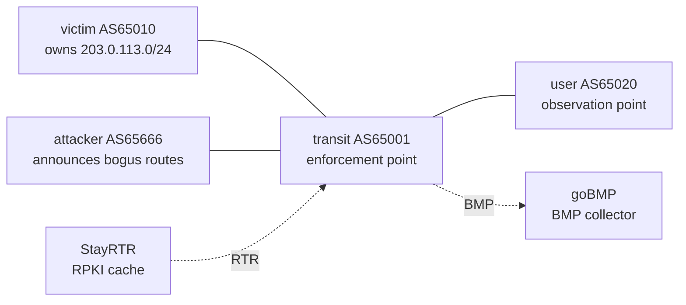

# BGP Hijack & Detection Lab

A fully reproducible, container-based lab for **attacking, defending, and detecting BGP prefix hijacks** on a single laptop. Every experiment runs in a closed lab I fully control, is measured with a clean before/after (A/B) method, and can be replayed with one command.

The lab tells one honest story: a simple hijack is stopped by standard defenses, but a smarter **forged-origin** hijack slips past RPKI/ROV, the origin check most networks rely on today. An intent-based detector then catches exactly what RPKI cannot, and a BMP feed lets it separate attacks that got through (**ACTIVE**) from attacks a defense already stopped (**BLOCKED**).

 

> **Scope, stated honestly.** BGP hijack detection and mitigation is a mature research field. The value here is **reproducible engineering + measured experiments in a controlled testbed**, not academic novelty. No public networks are ever touched.

## Why this lab

BGP has no built-in way to verify *"do you actually own this address block, and is this path real?"*. Routers trust their neighbors' announcements. This lab reproduces that weakness in miniature, runs concrete attacks, applies real defenses, finds **where those defenses break**, and detects the break.

## Topology



- **victim** originates the legitimate prefix `203.0.113.0/24`.
- **attacker** owns a legitimate `192.0.2.0/24` and, on demand, announces bogus routes: a sub-prefix `203.0.113.0/25`, or the victim's exact `/24` with a forged AS_PATH.
- **transit** is the provider both connect through: the point where traffic is redirected, or where a defense stops the attack.
- **user** is a third party whose traffic we track.
- **StayRTR** serves a self-made ROA to transit over RTR for RPKI validation.
- **goBMP** receives BMP from transit (pre-policy and post-policy views) and prints each update as JSON.

StayRTR and goBMP live on the management network with pinned addresses (`172.20.20.200`, `172.20.20.201`), so one `deploy` brings up all six nodes.

## Results at a glance

| Attack | No defense | Prefix-list (in) | RPKI / ROV | Detector v1 (Loc-RIB poll) | Detector v2 (BMP) |
|---|---|---|---|---|---|
| **Sub-prefix** (`/25`) | HIT (E2) | BLOCKED (E3) | BLOCKED (E4) | not visible once blocked (E6) | **BLOCKED**: R1 + R2 (E7) |
| **Forged-origin** (`/24`) | HIT (E5) | BLOCKED\* (E8) | **HIT: bypass** (E5) | **CAUGHT**: R3 (E6) | **ACTIVE**: R3 (E7) |

\* First hop only. The transit knows exactly which prefixes its customer may announce, so it can reject anything else. Once a forged route arrives from a provider or peer that legitimately carries the prefix, a prefix-list cannot tell it apart, which is why forged-origin hijacks spread.

Full matrix and evidence: [`RESULTS-matrix.md`](RESULTS-matrix.md) · chronological log: [`LABNOTES.md`](LABNOTES.md).

## Key findings

- **`0% packet loss` can hide an attack.** During a hijack the ping still succeeds because the *attacker* answers. Availability stays intact while integrity is broken; silent interception is worse than an outage.
- **RPKI labels, policy enforces.** RPKI marks a sub-prefix hijack `Invalid`, but that alone does not stop it: the route stays best and installed. A route-map rejecting `Invalid` routes turns the label into protection.
- **RPKI validates the origin, not the path.** The forged-origin hijack announces the victim's exact `/24` with AS_PATH `65666 65010`. RPKI sees origin `65010`, matches the ROA, and marks it **Valid**, so ROV lets it through. This is the gap that BGPsec (path signing) and ASPA (AS-relationship validation) exist to close.
- **Prefix filters stop forged-origin, but only at the edge.** A per-customer prefix-list checks the prefix, not the path, so it rejects the forged `/24` at the first hop (E8). It cannot help further upstream.
- **Intent-based detection catches what prevention misses.** The detector flags the forged route because the implied link `65666 -> 65010` is not a real adjacency, even while RPKI calls it `valid` and before the route wins best-path.
- **Where a detector looks decides what it sees.** Reading the post-policy Loc-RIB, detector v1 cannot see an attack a defense already blocked. Detector v2 reads BMP pre-policy and post-policy views and reports blocked attempts too.

## Requirements

- Linux with Docker
- [containerlab](https://containerlab.dev)
- Python 3 (standard library only)
- Runs on a 4-thread / 8 GB laptop: FRR routers use ~65 MiB each (measured); the StayRTR and goBMP images are ~27 MB and ~16 MB.

Exact versions are in [`VERSIONS.md`](VERSIONS.md) (FRR pinned by digest; StayRTR and goBMP digests recorded).

## Quick start

```bash
# 1. validate router configs (with a built-in negative-control self-test)
./scripts/lint.sh

# 2. deploy everything: 4 FRR routers + StayRTR (RPKI cache) + goBMP (BMP collector)
containerlab deploy -t bgp-lab.clab.yml

# 3. run an attack
./scenarios/01-subprefix-hijack.sh     # sub-prefix hijack (blocked by ROV)
./scenarios/02-forged-origin.sh        # forged-origin hijack (bypasses RPKI)

# 4a. detector v1: polls the transit's post-policy table
python3 detector/detect.py

# 4b. detector v2: reads the BMP stream (pre- and post-policy)
docker logs clab-bgp-lab-gobmp 2>&1 | python3 detector/detect_bmp.py

# 5. restore a clean baseline
./scenarios/restore.sh
./scenarios/restore-forged.sh

# 6. tear down
containerlab destroy -t bgp-lab.clab.yml --cleanup
```

Tip: `docker restart` does not clear container logs. To analyse a clean window, note the time, restart goBMP, and read with `docker logs --since <time>`.

## Repository layout

```
configs/              per-router FRR configs (bind-mounted read-only)
rpki/                 self-made ROA served to routers via StayRTR
scenarios/            repeatable attack + restore scripts
scripts/lint.sh       config validator with a negative-control self-test
detector/detect.py      v1: polls the post-policy BGP table
detector/detect_bmp.py  v2: consumes the goBMP stream (pre/post-policy)
detector/intent.json    ground truth: protected prefixes, legit origin, real adjacencies
bgp-lab.clab.yml      containerlab topology (topology-as-code)
VERSIONS.md           pinned environment for reproducibility
LABNOTES.md           dated experiment log (E2-E8)
RESULTS-matrix.md     attack x defense x detection results (RQ1)
```

## Experiments

| ID | What it shows |
|---|---|
| E2 | Sub-prefix hijack succeeds with no defense; traffic is redirected at the transit. |
| E3 | A prefix-list (whitelist, inbound) blocks the sub-prefix hijack cleanly. |
| E4 | RPKI/ROV blocks it too, but only once a route-map enforces `deny Invalid`. |
| E5 | Forged-origin hijack bypasses RPKI/ROV; with higher local-pref it wins best-path while ROV is active. |
| E6 | Detector v1 catches the RPKI-valid forged-origin route via an invalid-adjacency rule; it cannot see blocked attacks. |
| E7 | Detector v2 (BMP) reports forged-origin as ACTIVE and the ROV-blocked sub-prefix as BLOCKED. |
| E8 | Tested prefix-list against forged-origin: blocked at the first hop. This corrects an earlier, untested matrix entry that said HIT. |

## Detection design

Both detectors check routes against `detector/intent.json`, which declares the protected prefixes, their legitimate origin, and the real AS adjacencies:

- **R1 wrong-origin**: origin AS differs from the declared legit origin.
- **R2 sub-prefix**: a route more specific than a protected prefix.
- **R3 invalid-adjacency**: the route claims the legit origin, but the AS right before it in the path is not a declared neighbor of that origin. This ASPA-style check is what catches forged-origin.

**v1** polls `show ip bgp json` on the transit. Simple, but it only sees the post-policy table.

**v2** consumes goBMP JSON. For each unique route `(prefix, peer, AS_PATH)` it records whether the route was ever seen pre-policy and whether it was ever added post-policy: **BLOCKED** if only seen pre-policy, **ACTIVE** if it reached post-policy but not the Loc-RIB, and **WINNING** if it entered the Loc-RIB (it won best-path and traffic is actually diverted). Keying on the AS_PATH keeps a forged path from colliding with a harmless propagation echo from the same peer, and the "ever-seen" flags make the result robust to message order and to the initial table dump BMP replays with old timestamps. It took three failed designs to get here; they are documented in [`LABNOTES.md`](LABNOTES.md).

## Roadmap

- [x] Baseline topology + sub-prefix hijack (E2)
- [x] Prefix-list defense (E3, E8)
- [x] RPKI / ROV, and its limits (E4, E5)
- [x] Forged-origin hijack that bypasses RPKI-ROV (E5)
- [x] Intent-based detector v1 (E6)
- [x] BMP-fed detector v2 with ACTIVE / BLOCKED classification (E7)
- [x] StayRTR and goBMP as native containerlab nodes
- [x] Loc-RIB monitoring separates "passed policy" from "won best-path"
- [ ] Live streaming alerts instead of batch analysis over logs
- [ ] Pin the StayRTR and goBMP images by digest in the topology
- [ ] Exact-prefix hijack with a second transit (best-path competition)
- [ ] Route leaks + BGP Roles/OTC

## Limitations

- The topology is small (4 ASes); impact results are illustrative, not internet-scale.
- Detector v2 analyses logs in batch; it does not raise live alerts yet.
- **ACTIVE** means the route passed policy, not that it won best-path.
- The "ever-seen" model records when a route appeared, not when it went away.
- StayRTR and goBMP use `latest` tags in the topology; their digests are recorded in `VERSIONS.md`.
- Novelty is reproducible engineering, not a new detection method.

## Safety & ethics

All experiments run **only** inside this local lab. Address space uses documentation prefixes (`203.0.113.0/24`, `192.0.2.0/24`, RFC 5737) and private ASNs (RFC 6996). No peering to real routers, no scanning, no traffic to any network I do not own.

## References

- Sermpezis et al., *ARTEMIS: Neutralizing BGP Hijacking within a Minute*, IEEE/ACM ToN, 2018 (arXiv:1801.01085).
- Al-Musawi et al., *BGP Anomaly Detection Techniques: A Survey*, IEEE Comms Surveys & Tutorials, 2017.
- RFCs: 4271 (BGP-4), 6482 (ROA), 6811 (Origin Validation), 7854 (BMP), 8210 (RTR), 9234 (BGP Roles), 5737 / 6996 (documentation prefixes / private ASNs).
- goBMP, BMP collector: https://github.com/sbezverk/gobmp
- RIPE Labs, *BGP Leaks in Indonesia* (the 2014 AS4761 incident).

## Author

Ridho ([@ridhofri](https://github.com/ridhofri)), telecommunications engineering student. I built this lab because reading about BGP hijacks wasn't enough; I wanted to reproduce one, watch traffic get redirected, find where defenses break, and detect the break. Suggestions and issues welcome.
