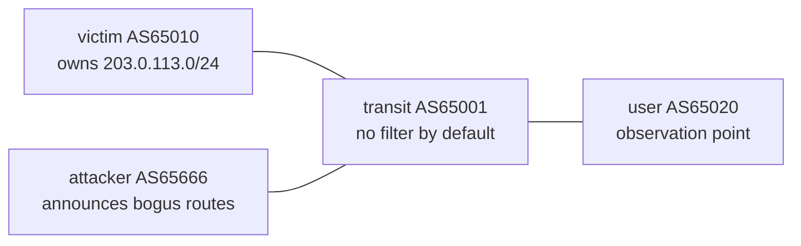

# BGP Hijack & Route-Anomaly Lab

A fully reproducible, container-based lab for **studying BGP prefix hijacking and its defenses** on a single laptop. Every attack is injected in a closed lab I fully control, measured with a clean before/after (A/B) method, and can be replayed with one command.

> **Scope, stated honestly:** BGP hijack detection and mitigation is a mature field. The value here is **reproducible engineering + measured experiments in a controlled testbed**, not academic novelty. No public networks are ever touched.

## Why this lab

BGP has no built-in way to verify *"do you actually own this address block?"*. Routers trust their neighbors' announcements. This lab reproduces that weakness in miniature, demonstrates concrete attacks, applies real defenses, and **quantifies which defense stops which attack**.

## Topology



- **victim** originates the legitimate prefix `203.0.113.0/24`.
- **attacker** owns a legitimate `192.0.2.0/24` and, on demand, announces a bogus `203.0.113.0/25` (a sub-prefix of the victim's space).
- **transit** is the provider both connect through; it is the point where traffic is redirected — or where a defense stops the attack.
- **user** is a third party whose traffic we track.

## Requirements

- Linux with Docker
- [containerlab](https://containerlab.dev)
- ~200 MiB RAM for the 4-node lab (measured; scales to ~35 nodes on 8 GB)

Exact pinned versions are recorded in [`VERSIONS.md`](VERSIONS.md) (FRR image pinned by digest for reproducibility).

## Quick start

```bash
# validate configs (with a built-in negative-control self-test)
./scripts/lint.sh

# deploy the 4-node topology
containerlab deploy -t bgp-lab.clab.yml

# run a sub-prefix hijack and watch traffic get redirected at the transit
./scenarios/01-subprefix-hijack.sh

# withdraw the attack, return to a clean baseline
./scenarios/restore.sh

# tear down
containerlab destroy -t bgp-lab.clab.yml --cleanup
```

## Findings so far

Full attack-vs-defense matrix: [`RESULTS-matrix.md`](RESULTS-matrix.md). Chronological log: [`LABNOTES.md`](LABNOTES.md).

| Attack | No defense | Prefix-list (inbound) | RPKI / ROV |
|---|---|---|---|
| Sub-prefix hijack (`/25`) | HIT — transit forwards to attacker | BLOCKED — `/25` never enters the table | BLOCKED — Invalid route rejected |

Two lessons worth highlighting:

- **`0% packet loss` can hide an attack.** During the hijack the ping still succeeded — because the *attacker* answered. Availability stayed intact while integrity was broken; silent interception is worse than an outage.
- **RPKI labels, policy enforces.** RPKI marked the hijack `Invalid` but that alone did not stop it — the route stayed best and installed. A route-map rejecting Invalid routes is what turned the label into real protection.

## Roadmap

- [x] Baseline topology + sub-prefix hijack (E2)
- [x] Prefix-list defense (E3)
- [x] RPKI / ROV (Route Origin Validation) (E4)
- [ ] Exact-prefix hijack with a second transit (best-path competition)
- [ ] Forged-origin hijack — showing where RPKI-ROV falls short
- [ ] Route leaks + BGP Roles/OTC
- [ ] BMP-fed anomaly detector (control-plane + data-plane signals)

## Safety & ethics

All experiments run **only** inside this local lab. Address space uses documentation prefixes (`203.0.113.0/24`, `192.0.2.0/24` — RFC 5737) and private ASNs (RFC 6996). No peering to real routers, no scanning, no traffic to any network I do not own.

## Author

Ridho ([@ridhofri](https://github.com/ridhofri))
